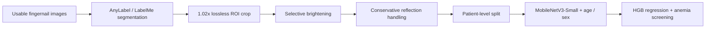

# Fingernail Anemia Screening

A proof-of-concept pipeline for **non-invasive anemia screening from fingernail images**, developed as an NTHU EECS special-topic project.

The project focuses on the full data path before and through model training: organizing the image set, segmenting the nail region, creating lossless ROI crops, handling dark images and reflection glare conservatively, preventing patient-level leakage, and evaluating lightweight deep-learning models for hemoglobin estimation and anemia classification.

> **Scope:** research prototype / screening experiment only. This repository does **not** represent a clinical diagnostic system and is not intended to replace CBC testing.
# Project Paper

**Anemia Prediction with Deep Learning from Fingernail Images**

The complete special-topic report is rendered directly below for immediate reading.


[Open the original PDF](docs/anemia_prediction_with_deep_learning.pdf)

## Pipeline



## Best internal result

The strongest balanced preprocessing run used **3,190 nail-crop images from 820 patient records**. The final test split contained 82 patient records.

| Task | Metric | Result |
|---|---:|---:|
| HGB regression | MAE | **1.90 g/dL** |
| HGB regression | Pearson r | **0.52** |
| Anemia classification | ROC-AUC | **0.71** |
| Anemia classification | Precision | **0.76** |
| Anemia classification | Recall | **0.71** |
| Anemia classification | F1 | **0.73** |

These are **internal results from one project dataset**, not external clinical validation.

## What is in this repository

### Data management

- `organize_messy_folder_exact_copy_v2_zero_bytes_fixed.ipynb` — exact-copy organization of raw image folders into usable / unusable / anomaly groups.
- `compare_original_vs_organized_folder_consistency.ipynb` — consistency checks between original and reorganized folders.
- `make_image_manifest_SIMPLE.ipynb` — image manifest generation.
- `move_segmentation_jsons_into_organized_folders.ipynb` — moves/copies segmentation JSON files beside their corresponding organized images.

### Image preprocessing

- `segmentation_roi102_lossless_pipeline.ipynb` — AnyLabel/LabelMe nail segmentation and 1.02x ROI crop pipeline.
- `segmentation_roi102_lossless_pipeline_flat_output.ipynb` — flat-output version of the ROI pipeline.
- `segmentation_roi102_lossless_pipeline_flat_output_transparent.ipynb` — transparent-background ROI version.
- `brighten_roi_lossless_pipeline_same_folder.ipynb` — selective brightening for dark crops while keeping PNG output lossless.
- `reflection_glare_removal_lossless_pipeline.ipynb` — conservative reflection handling using glare masks, inpainting/softening, and unusable-image flags.
- `reflection_glare_removal_pallor_safe_refined_pipeline.ipynb` — refined glare-removal pipeline designed to avoid removing naturally pale nail regions.
- `reflection_glare_pixel_removal_lossless_pipeline.ipynb` — experimental pixel-removal variant.

### Models

- `anemia_regnet400mf_no_leakage_pipeline.ipynb` — RegNet-400MF model pipeline with patient-level leakage checks.
- `anemia_mobilenetv3_macbook_lite_REVIEWED_v5_with_update_log.ipynb` — final lightweight MobileNetV3-Small experiment used for the report results.

The final MobileNetV3 pipeline uses a pretrained image backbone fused with **age and sex** features. **Race and ethnicity are not model inputs**; they are retained only for subgroup checks in the project analysis.

## Preprocessing behavior

The project deliberately uses conservative image processing because nail color is part of the signal being studied.

- ROI crops are expanded by **1.02x on the original image coordinates** rather than resizing a tight crop.
- Crops are saved as PNG to avoid adding JPEG recompression.
- Brightening is applied only to images that fall below the brightness threshold.
- Reflection handling distinguishes between small, larger, and excessive glare.
- Images with too much glare are flagged instead of forcing an artificial reconstruction.

In the documented preprocessing run, 3,467 crops were processed: 1,325 had no detected glare, 1,511 had small glare inpainted, 376 had larger glare softened, and 255 were marked as having too much glare.

## Repository structure

```text
fingernail-anemia-screening/
├── README.md
├── SETUP.md
├── DATA_NOT_INCLUDED.md
├── ORIGINAL_FILE_MANIFEST.tsv
├── docs/
│   └── anemia_prediction_with_deep_learning.pdf
└── notebooks/
    ├── data-management/
    ├── preprocessing/
    └── models/
```

## Data availability

The original project includes subject-level clinical/demographic CSV files and local image inventories. They are intentionally **not published in this portfolio repository**. See [`DATA_NOT_INCLUDED.md`](DATA_NOT_INCLUDED.md).

The notebooks themselves are preserved as submitted; their code has not been refactored or rewritten for this repository.

## Report

The full project report is available at:

[`docs/anemia_prediction_with_deep_learning.pdf`](docs/anemia_prediction_with_deep_learning.pdf)

## Limitations

- No external validation dataset was available.
- The strongest run contains only 82 test records.
- The usable/unusable image filtering stage predates the final report and is not itself evaluated as a classifier here.
- Reflection handling is heuristic and still requires quality review.
- The lightweight frozen backbone was chosen partly for practical training/debugging on a MacBook.
- The system estimates screening risk; it does not diagnose anemia.
